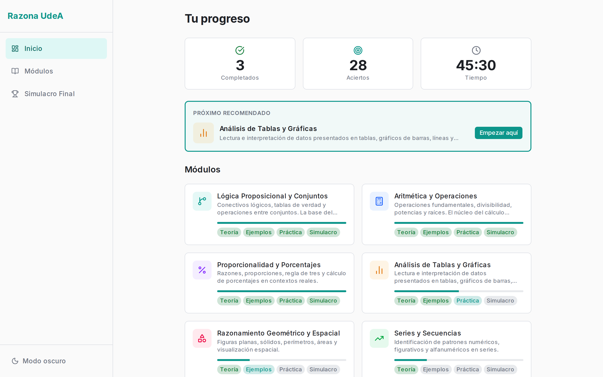
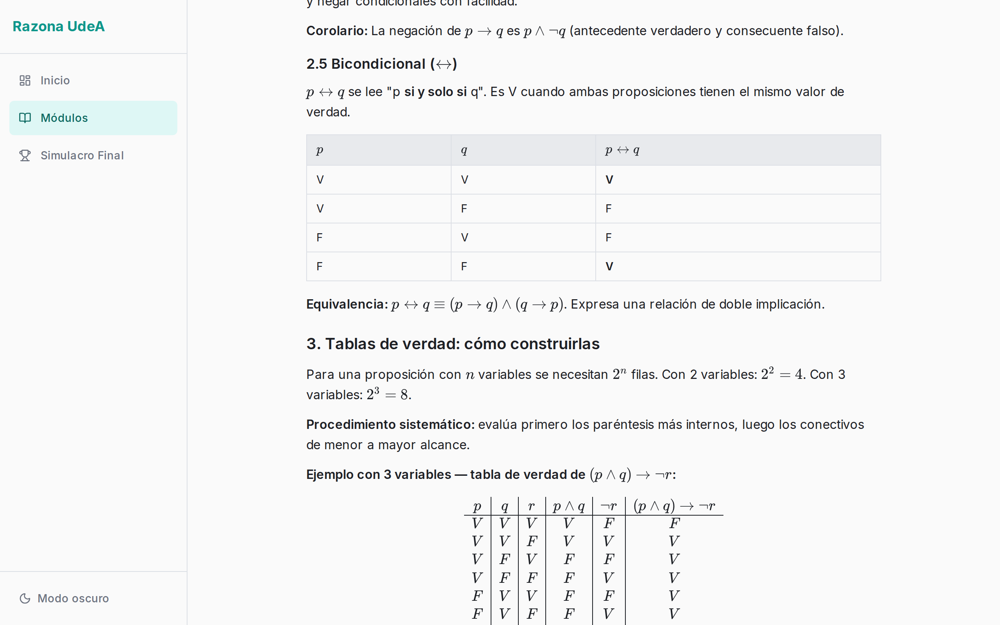
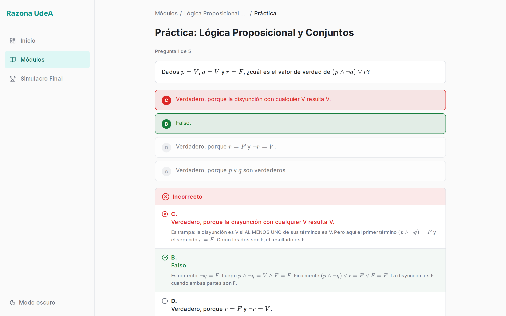
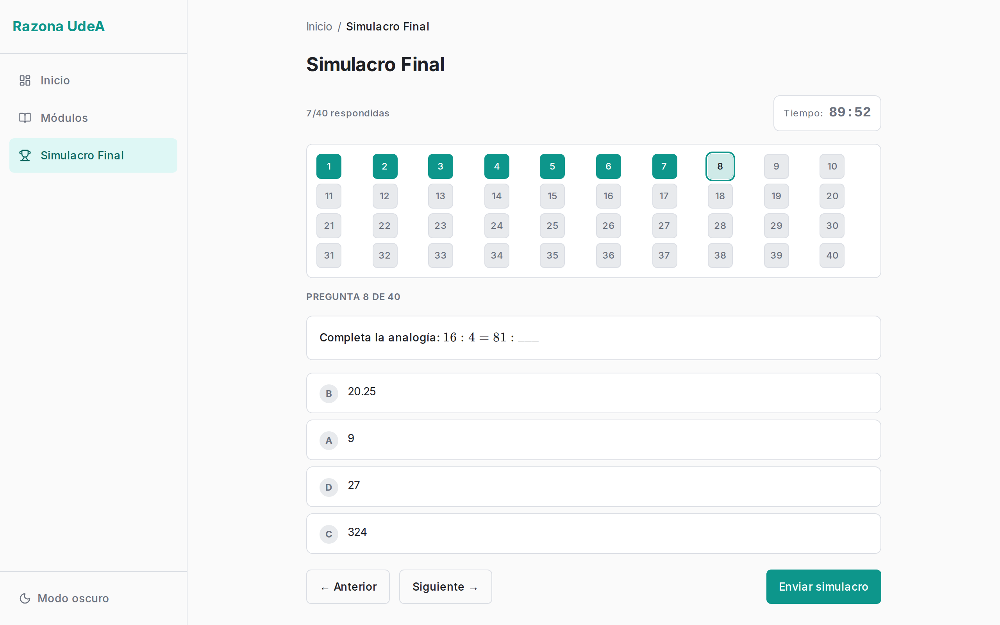
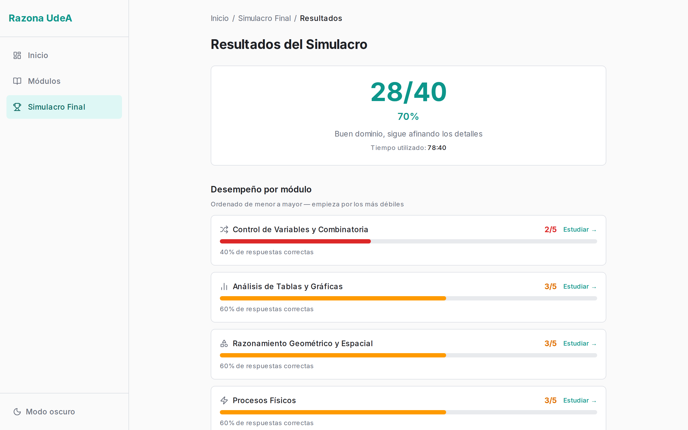

# Razona UdeA

**A structured, offline-first study app for the Logical Reasoning section of the Universidad de Antioquia admission exam.**

[](https://nextjs.org)
[](https://react.dev)
[](https://www.typescriptlang.org)
[](https://tailwindcss.com)
[](https://ui.shadcn.com)
[](https://mdxjs.com)
[](LICENSE)

## Screenshots

<p align="center">
  
  <br>
  <em>Dashboard — completed modules, cumulative correct answers and time studied, with the next recommended module surfaced on top.</em>
</p>

<p align="center">
  
  <br>
  <em>Theory — formulas and truth tables rendered server-side with KaTeX. Every module also ships an ELI10 version, one toggle away.</em>
</p>

<p align="center">
  
  <br>
  <em>Practice — after answering, all four options expand with their explanation: why the right one is right, and which misconception each distractor is built on.</em>
</p>

<p align="center">
  
  <br>
  <em>Final mock exam — 90-minute countdown and 40 navigation dots marking answered, current and unanswered questions. The session survives a reload.</em>
</p>

<p align="center">
  
  <br>
  <em>Results — score breakdown per module, weakest first, each linking straight back to the module worth reviewing.</em>
</p>

## What is this?

The Universidad de Antioquia admission exam includes Logical Reasoning as a major, heavily weighted section — one that spans formal logic, arithmetic, proportional reasoning, data interpretation, geometry, sequences, combinatorics, and physical processes. Studying for it usually means scattered PDFs and past papers with answer keys that tell you *what* was correct but never *why* your answer was wrong.

Razona UdeA replaces that with a structured curriculum. Every topic follows the same four-stage progression, and each stage is a real page in the app:

1. **Theory** — the concepts, with formulas rendered properly (not screenshots of equations)
2. **Worked examples** — full step-by-step solutions
3. **Practice** — interactive questions with a hint system and feedback on *every* option
4. **Mock exam** — timed, no hints, exam conditions

The pedagogical core is the feedback model. Every answer option in the content — correct and incorrect alike — carries its own `explicacion` field naming the specific misconception behind it ("this is the intersection, not the difference"; "this is the direct product without dividing by the GCD"). You learn why the distractor was designed to catch you, not just that you missed.

The app runs entirely in the browser. No backend, no accounts, no environment variables, no network calls after first load.

### The eight modules

All content is authored in `content/modulos/` and lives outside the bundler as MDX + JSON:

| # | Module | Focus |
|---|--------|-------|
| 1 | **Lógica Proposicional y Conjuntos** | Logical connectives, truth tables, set operations |
| 2 | **Aritmética y Operaciones** | Fundamental operations, divisibility, powers and roots |
| 3 | **Proporcionalidad y Porcentajes** | Ratios, proportions, rule of three, percentages |
| 4 | **Análisis de Tablas y Gráficas** | Reading tables, bar/line/pie charts |
| 5 | **Razonamiento Geométrico y Espacial** | Plane figures, solids, perimeter, area, spatial visualization |
| 6 | **Series y Secuencias** | Numeric, figurative and alphanumeric pattern recognition |
| 7 | **Control de Variables y Combinatoria** | Counting principles, permutations, combinations |
| 8 | **Procesos Físicos** | Physical phenomena via graphs and quantitative reasoning |

### Content volume

Counted directly from `content/modulos/`:

| Asset | Per module | Total |
|-------|-----------|-------|
| Theory (standard + ELI10) | 2 MDX files | 16 files, ~22,000 words |
| Worked examples | 5 | **40** |
| Practice questions | 12 | **96** |
| Mock exam questions | 8 | **64** |
| | | **160 multiple-choice questions**, each with 4 explained options |

## Features

**Two theory modes.** Every module ships two MDX files: the standard treatment and an ELI10 version that swaps formal notation for everyday analogies. Toggling is a `?simple=1` query param, so the page stays a Server Component and the MDX never crosses the client boundary.

**Server-rendered math.** Formulas are authored as LaTeX in MDX and JSON. MDX goes through `remark-math` → `rehype-katex`; strings inside JSON render through a `MathText` component built on `react-markdown` with the same plugin chain. Raw LaTeX is never shipped to the user, and there is no flash of unformatted content.

**Practice sessions that vary.** Each session draws 5 questions at random from the module's 12-question bank and shuffles the answer options within each one, so repeating a module isn't a memorization exercise. A hint is available before answering and disappears once you commit. After answering, all four options expand with their explanations. Your best score is what persists — not your latest.

**Timed module mocks.** 5 questions in 5 minutes, no hints, no feedback until the end.

**Final mock exam.** 40 questions in 90 minutes, drawn as a stratified sample of exactly 5 per module so every topic is represented, then shuffled so questions don't arrive grouped. It includes navigation dots to jump between questions, a countdown with a low-time warning, and auto-submit at zero. **The session is crash-safe:** progress is written to `localStorage` as you go, and reopening the app offers to resume with the correct remaining time — computed from the stored start timestamp, not from an interval counter that drifts when the tab is backgrounded.

**Results that point somewhere.** The results screen breaks the score down per module and lists every missed question with the correct answer and its explanation, so a bad run turns into a study list.

**Progress tracking without an account.** All state lives in `localStorage` under three keys (`razona_progress`, `razona_simulacros`, `razona_simulacro_en_curso`). The dashboard surfaces completed modules, cumulative correct answers, and a recommended next module. Mock exam history is capped at the 10 most recent runs. Every read is wrapped in try/catch — private browsing mode degrades to an empty state instead of crashing.

**Mobile-first.** Bottom navigation on small screens, sidebar on desktop, and 44–48px minimum touch targets throughout — the app was built to be used on a phone.

**Dark and light themes** via `next-themes`, with no flash on initial load.

## Tech Stack

| Layer | Technology | Version |
|-------|-----------|---------|
| Framework | [Next.js](https://nextjs.org) (App Router, RSC) | 16.2.6 |
| UI runtime | [React](https://react.dev) | 19.2.4 |
| Language | [TypeScript](https://www.typescriptlang.org) (`strict: true`) | 5.9.3 |
| Styling | [Tailwind CSS](https://tailwindcss.com) (CSS-first `@theme`) | 4.3.0 |
| Components | [shadcn/ui](https://ui.shadcn.com) (`base-nova`) on [Base UI](https://base-ui.com) | 4.7.0 / 1.4.1 |
| Content | [next-mdx-remote](https://github.com/hashicorp/next-mdx-remote) (`/rsc`) | 6.0.0 |
| Math | [KaTeX](https://katex.org) + `remark-math` + `rehype-katex` | 0.16.45 |
| Markdown | `react-markdown` + `remark-gfm` | 10.1.0 / 4.0.1 |
| Icons | [lucide-react](https://lucide.dev) | 1.14.0 |
| Theming | [next-themes](https://github.com/pacocoursey/next-themes) | 0.4.6 |
| Toasts | [sonner](https://sonner.emilkowal.ski) | 2.0.7 |
| Package manager | pnpm | — |

## Architecture

Content is read from disk in Server Components; only the data a given screen needs crosses to the client:

```
content/modulos/[slug]/*.{mdx,json}
        │
        ▼
src/lib/content.ts          ← 'server-only', fs + path
        │
        ▼
Server Component (page.tsx)
        │  props
        ▼
Client Component            ← state, timers, localStorage
        ▲
        │
src/lib/storage.ts          ← localStorage, SSR-guarded
```

`src/lib/content.ts` is marked `'server-only'`, so importing it from a Client Component is a build error rather than a runtime leak. `src/lib/storage.ts` guards every access with `typeof window === 'undefined'` and is only ever called inside effects, which keeps hydration clean.

Because module slugs are known at build time, module pages are prerendered via `generateStaticParams` — the build output marks `/modulos/[slug]`, `/ejemplos`, `/practica` and `/simulacro` as SSG across all 8 modules. Only `/modulos/[slug]/teoria` is dynamic, since it reads the `?simple=1` search param.

### Routes

| Route | Rendering | Purpose |
|-------|-----------|---------|
| `/` | Static | Redirects to the dashboard |
| `/dashboard` | Static + Client | Progress overview, stats, recommended module |
| `/modulos` | Static | Grid of all 8 modules |
| `/modulos/[slug]` | SSG | Module home — the 4 stages with their status |
| `/modulos/[slug]/teoria` | Dynamic | MDX theory, standard or ELI10 |
| `/modulos/[slug]/ejemplos` | SSG | Step-by-step worked examples |
| `/modulos/[slug]/practica` | SSG | Interactive practice with feedback |
| `/modulos/[slug]/simulacro` | SSG | Timed 5-question module mock |
| `/simulacro-final` | Static + Client | 40-question, 90-minute exam |
| `/simulacro-final/resultados` | Static + Client | Score breakdown and error review |

### Project structure

```
content/modulos/[slug]/      Educational content — 6 files per module
  meta.json                  Title, description, icon, order, color
  teoria.mdx                 Standard theory
  teoria-simple.mdx          ELI10 theory
  ejemplos.json              5 worked examples
  practica.json              12 practice questions
  simulacro.json             8 mock exam questions

src/
  app/                       App Router routes
  components/
    layout/                  AppShell, Sidebar, BottomNav, theming
    dashboard/               Stats, progress cards, recommendation
    modulos/                 Module cards, stage selector, badges
    teoria/                  MDX renderer, mode toggle
    ejercicios/              Practice controller, options, feedback, MathText
    simulacro/               Timers, navigation dots, exam controllers
    ui/                      shadcn/ui primitives
  lib/
    content.ts               Server-only content loaders
    storage.ts               localStorage read/write
    modules.ts               Static module registry (source of truth for order)
    utils.ts                 cn(), formatTime(), shuffle(), percentages
    colors.ts, icons.ts      Token and icon maps
  types/index.ts             Shared TypeScript types
```

## Getting Started

### Prerequisites

- Node.js 20+ (required by Next.js 16)
- [pnpm](https://pnpm.io)

### Installation

```bash
git clone https://github.com/dacq7/razona-udea.git
cd razona-udea
pnpm install
pnpm dev
```

Open [http://localhost:3000](http://localhost:3000).

**No environment variables are required.** The app has no backend, no database and no external services — `process.env` is not read anywhere in `src/`. Clone, install, run.

### Scripts

| Command | Description |
|---------|-------------|
| `pnpm dev` | Development server |
| `pnpm build` | Production build |
| `pnpm start` | Serve the production build |
| `pnpm lint` | ESLint |

### Adding or editing content

Content is plain MDX and JSON — no CMS, no rebuild step beyond `pnpm build`. To edit a module, open `content/modulos/[slug]/` and change the relevant file. The loaders in `src/lib/content.ts` return empty arrays when a file is missing or malformed, and every page renders an empty state instead of crashing, so partial content is safe to commit.

When writing questions, the content contract is: exactly 4 options, exactly one with `es_correcta: true`, and **every** option carries an `explicacion` — for correct options, why it's right; for distractors, the specific misconception that leads there. Formulas go in LaTeX (`$inline$`, `$$display$$`).

## License

[MIT](LICENSE) © 2026 Diego A. Correa

---

Built by **Diego Correa** — [Veridis Dev](https://veridisdev.com)
